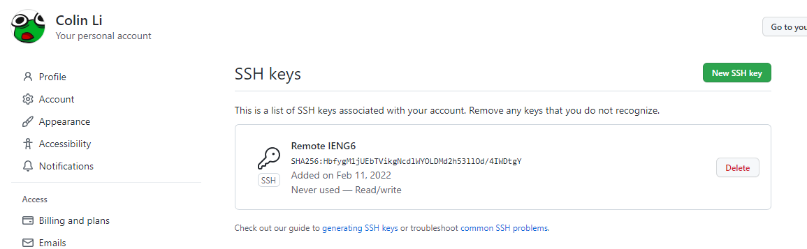
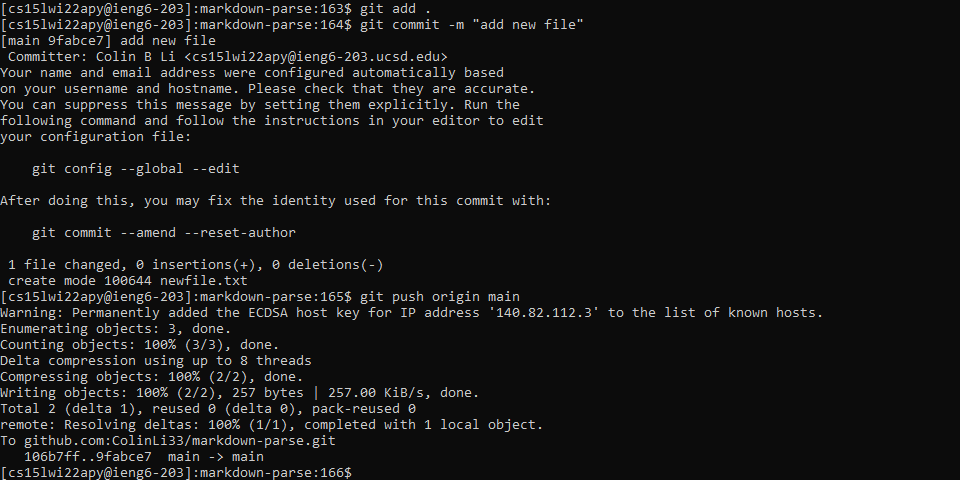

# CSE 15L Week 6 Lab Report

## 1. Create Key Pair
* I created private and public keys using [this tutorial](https://docs.github.com/en/authentication/connecting-to-github-with-ssh/adding-a-new-ssh-key-to-your-github-account)

* Here is my public key that is connected to github

* Here is my private key that I will not show

## 2. Run Git Commands
* Now I can run git commands from the remote machine!!

* Here is the [link](https://github.com/ColinLi33/markdown-parse/commit/9fabce720aa1da9c29ff85a787369c32fe51792d) to my commit